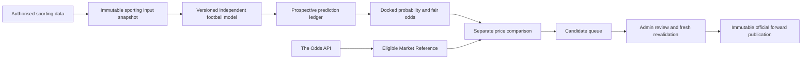

> Historical/superseded product document. Permanent fantasy product direction — 10 October 2026: [PRODUCT_DIRECTION](PRODUCT_DIRECTION.md) is authoritative. This document does not authorize old features, providers, jobs or launch gates.

# Docked independent modelling architecture

Phase 5D: the statistical estimator and private immutable training manifests are implemented. One research fit and a complete six-fixture prospective cohort are installed in Docked Preview. The model stays UNVALIDATED; the independent probability path does not import market adapters. Separate comparison remains blocked by current authority, with zero candidates/publications. Source-reported FT training acceptance does not grant regulation-results settlement rights.

Phase 5B revised direction, 4 October 2026. This supersedes any requirement to reconstruct historical Docked tips or demonstrate historical betting ROI before the official record can start. Historical sporting statistics remain permitted model inputs under their own rights; they are not Docked betting performance.

The initial football estimator has **no registered fitted implementation or authorised sporting dataset**. It returns NOT_CONFIGURED/abstains. Neither API credentials for market prices nor a configurable lifecycle grants a working predictive model. No LLM, bookmaker consensus, arbitrary coefficient, confidence score or promotional price supplies an official probability.

## Boundaries

- Sporting inputs contain dated canonical teams, competitions, completed regulation results and licensed source provenance. Their strict schemas reject odds, Market Reference and implied-probability fields. Historical results downloaded today may inform today's estimate, never a falsely backdated prediction.
- Each retained snapshot binds source/version, known/received clocks, data cutoff, sporting facts, missingness, rights and hashes. A future fitted estimator must bind its derived feature values reproducibly to that snapshot; no feature builder is installed yet. As-of time is no later than calculation/record time, and the prospective record must commit before kickoff and before market comparison.
- A model adapter receives sporting inputs only. The market adapter is resolved only after the prediction/abstention has been recorded. Failure, stale prices or no qualifying Edge cannot erase the prediction.
- Football produces the complete home/draw/away distribution, checked to sum exactly to one in the normalized stored decimal representation. Fair odds are its reciprocals. Each 1X2 selection has a win/loss payoff; this does not turn a push/Asian/exchange market into a binary bet. Unsupported rules abstain.
- Price comparison uses eligible current Market Reference availability, independently of any market-derived pricing probability. Decimal arithmetic computes EV `p*O-1`; the minimum `(1+e)/p` rounds upward to a supported price tick. A 58% probability and 5% requirement need **1.82** at a cent tick, not 1.81.
- The versioned policy freezes threshold, odds bounds, decision windows, data age, model version, one Edge per event and one standard unit. No strategy is seeded or threshold selected in this phase.

## Four distinct records

| Record | Purpose | Public betting ROI? |
|---|---|---|
| Model prediction ledger | All eligible prospective probabilities and abstentions; calibration and data reliability | No |
| Paper Edge ledger | Prospective qualifying opportunities before public release | No public performance claim |
| Official Docked record | Every genuine approved live publication from its actual start | Yes, when actual records exist |
| Community ledger | Member selections measured at server-controlled Market Reference | Separate member performance |

The old market-consensus baseline/replay tools remain labelled research/data-quality instruments. They cannot be relabelled as Football V1 or promoted into new official publications.

## Approval and versioning

The model lifecycle is **DRAFT → RESEARCH → FORWARD_CALIBRATION → APPROVED_FOR_CANDIDATES → APPROVED_FOR_LIVE → RETIRED**. Current admin identity, MFA, code/configuration provenance and explicit evidence are required for gated transitions. No historical betting ROI or arbitrary months-long paper period is a gate. The owner later assesses sanity, calibration, probability validity, operational reliability and prospective observations, subject to data/legal requirements.

Material methodology, input source, feature, weighting or coefficient changes require a new immutable version and effective date. Old outputs remain unchanged. Public methodology disclosures may describe the changed source/features/method without publishing private coefficients. An unintroduced model has no invented introduction date.

## Implementation map

`src/core/football-model.ts` defines sporting-only contracts and unavailable-model behavior; `src/core/model-calibration.ts` defines prospective scoring; `src/core/football-edge.ts` separates retained predictions from market comparison. Private database ledgers and server services enforce provenance, role checks and immutable records. The scanner remains a backend durable job, never a browser timer or a daily ChatGPT task.

See [Football V1](FOOTBALL_MODEL_V1.md), [data requirements](FOOTBALL_DATA_REQUIREMENTS.md), [provider research](FOOTBALL_DATA_PROVIDER_RESEARCH.md), [prediction ledger](MODEL_PREDICTION_LEDGER.md), [calibration](FORWARD_CALIBRATION.md) and [official record](OFFICIAL_RECORD.md).

